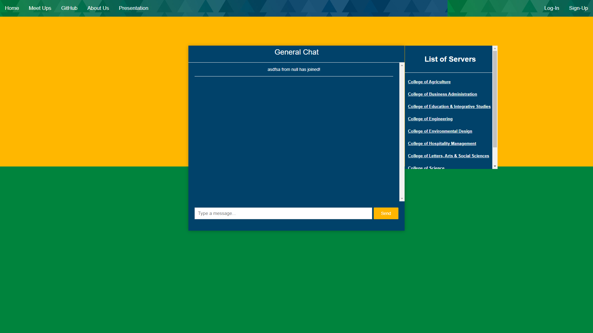
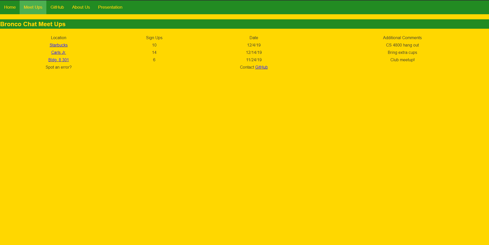

# Bronco Chat

A way to connect with fellow Cal Poly Pomona Students

## Getting Started





## How to run

Importing the Project into Eclipse

1. File->Import->Maven->Existing Maven Projects
2. Select the directory containing the pom.xml file
3. Finish

Run Project Locally

1. Locate the WebsocketDemoApplication.java in src/main/java/com/example/websocketdemo and right-click on it->Run As->Java Application
2. Verify at: 
```
http://localhost:8080/
```

## Built With

* aaaaaaa
* aaaaaaa
* aaaaaaa
* aaaaaaa

## Authors

* aaaaaaa
* aaaaaaa
* aaaaaaa
* aaaaaaa
* aaaaaaa